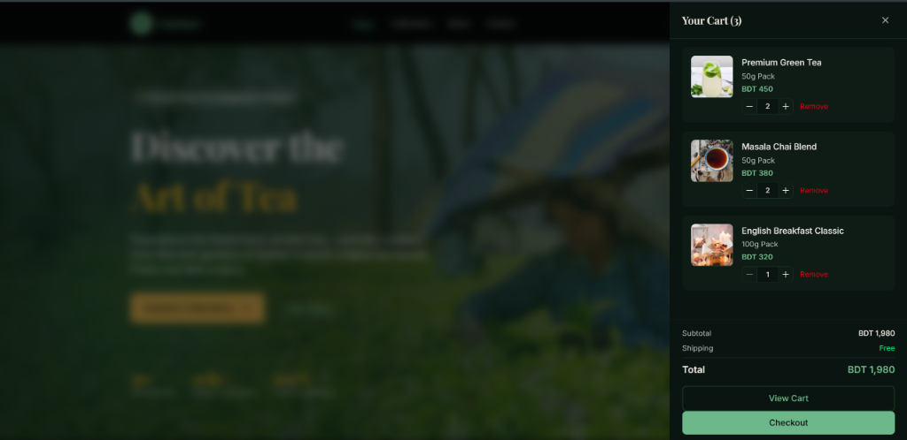
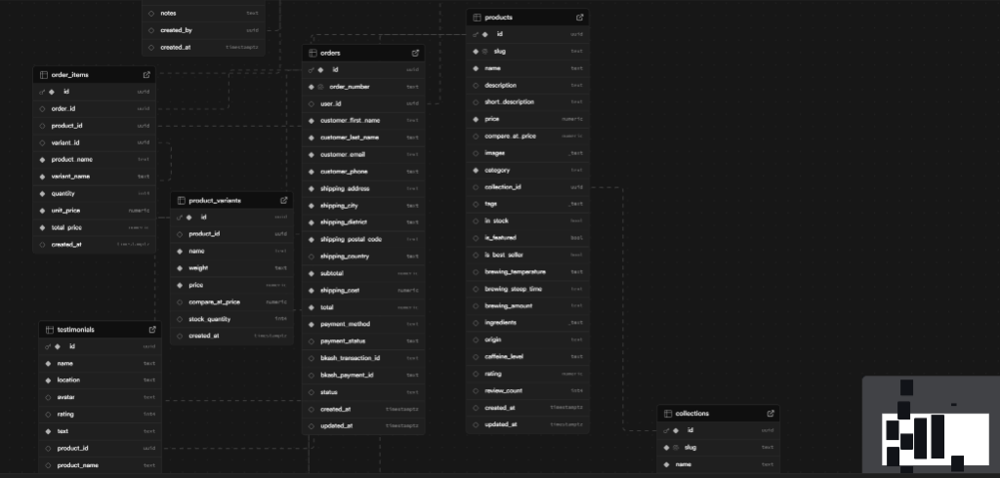

# ChaiBari - Premium Tea E-commerce

A modern, premium e-commerce platform for tea, built with Next.js, TypeScript, and Supabase.

**Live Demo:** [https://kishor20.netlify.app/](https://kishor20.netlify.app/)

## Screenshots

<div style="display: flex; gap: 10px; flex-wrap: wrap;">
  
  
</div>

### Database Schema



## Environment Variables

Create a `.env.local` file with:

```bash
NEXT_PUBLIC_SUPABASE_URL=your_supabase_url
NEXT_PUBLIC_SUPABASE_ANON_KEY=your_anon_key
```

## Development

```bash
npm install
npm run dev
```

## Build

```bash
npm run build
npm start
```

## Deployment

This project is configured for Netlify deployment. Set environment variables in the Netlify dashboard.

or use ur own SHIT , IDC .